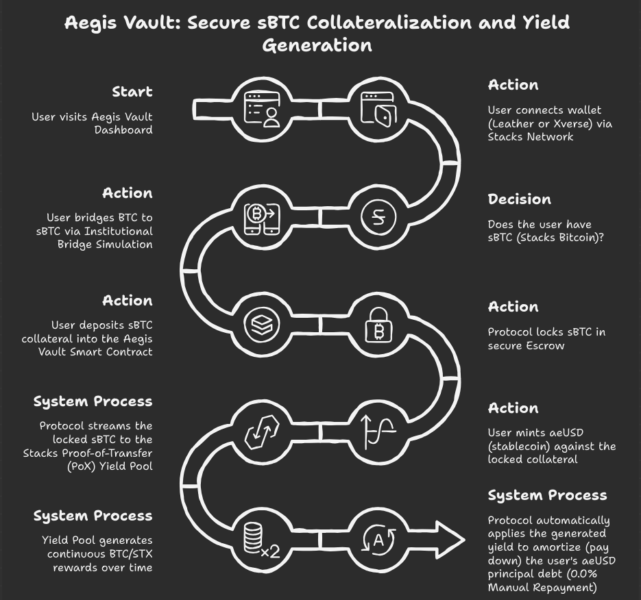
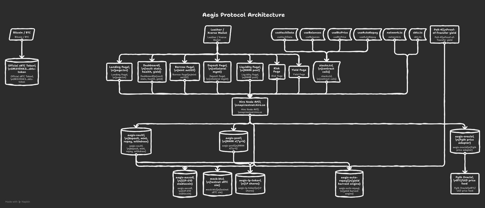
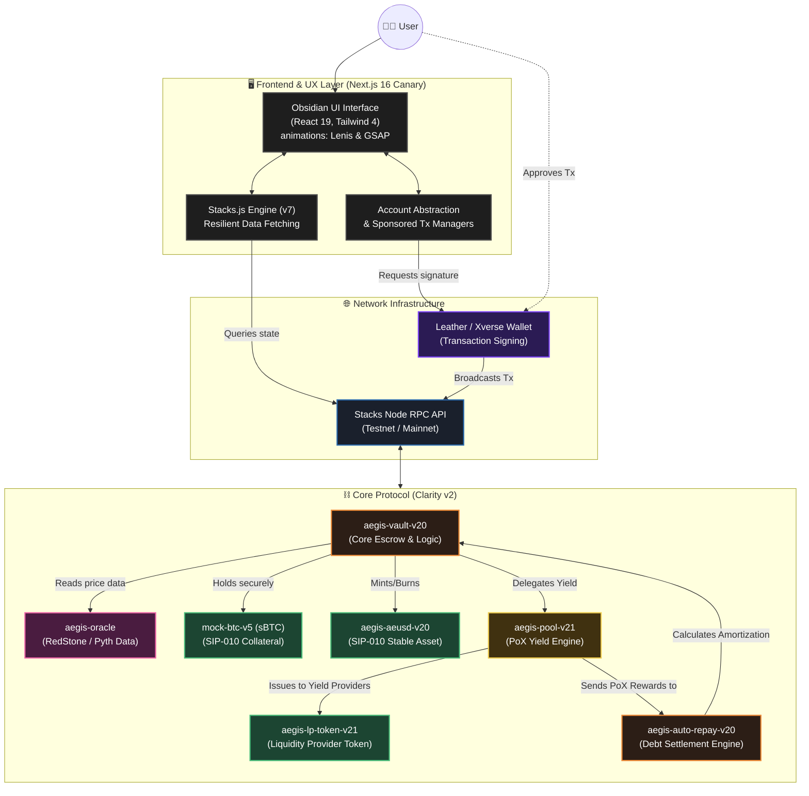

<div align="center">
  

# Aegis Vault: The Bitcoin-Native Federal Reserve

**Transforming Bitcoin from a "passive store of value" into an "active, self-repaying asset."**

[](https://nextjs.org/)
[](https://stacks.co/)
[](https://clarity-lang.org/)
[](https://react.dev/)
[](https://tailwindcss.com/)
[](https://opensource.org/licenses/MIT)

[Pitch Deck](./pitch.md) · [UI Specs](./ui.md) · [Technical Deep Dive](./docs/idea.md)

</div>

---

## The Vision

> "Bitcoin has a **$2 Trillion problem**: it's lazy money. Aegis Vault makes Bitcoin work so you don't have to."

Aegis Vault is a decentralized, non-custodial credit protocol built on **Stacks (the Bitcoin L2)**. By integrating the revolutionary **sBTC** alongside Stacks' native **Proof-of-Transfer (PoX)** rewards system, we have designed an economic model where your loans aren't an active burden—they are a self-sustaining financial strategy. 

Mint institutional-grade stablecoins (**aeUSD**) against your Bitcoin collateral, and watch as the protocol yield automatically settles the principal debt over time. **0.0% Manual Repayments.**

---

## � Key Features

*   **⚡ Instant Liquidity**: Peg-in BTC and mint **aeUSD** in a single click, powered by an account-abstracted UX with sponsored gas transactions.
*   **🔄 The Self-Repaying Engine**: Protocol yield (PoX/LP rewards) generated by your collateral is automatically redirected to satisfy your principal debt line.
*   **💎 Obsidian Aesthetic UI**: A premium, high-stakes dashboard interface utilizing React 19, Tailwind CSS v4, smooth-scrolling via **Lenis**, and fluid WebGL 3D elements powered by **OGL** and **GSAP/Framer Motion**.
*   **🛡️ Mathematical Security**: Engineered with **Clarity 2.0**, a decidable, non-Turing complete smart contract language designed to mathematically prove solvency and eliminate major vectors of smart contract exploits (e.g., reentrancy).
*   **🌐 Resilient Infrastructure**: Native integration with Stacks.js v7 and official Node APIs for ultra-low latency, real-time network resilience.

---

## 🧩 Technical Architecture & System Workflow

Aegis Vault utilizes a sophisticated multi-layered synchronization between the Next.js frontend, wallet layers, the Stacks Blockchain, and Clarity Smart Contracts.

### User Flow

<div align="center">
  
</div>

<br>

### System Topography

<div align="center">
  
</div>

<br>



---

## 📜 Smart Contract Registry (Testnet)

| Contract Base File | SIP Standard | Principal Address (Mock Testnet) |
| :--- | :--- | :--- |
| `aegis-vault.clar` | Core Logic | `ST2NJZE3SPW0GCPC0YE4V805HTSAGNQJF1HXT6PKY.aegis-vault-v20` |
| `aegis-auto-repay.clar`| Yield Logic | `ST2NJZE3SPW0GCPC0YE4V805HTSAGNQJF1HXT6PKY.aegis-auto-repay-v20` |
| `aegis-pool.clar`  | LP / PoX | `ST2NJZE3SPW0GCPC0YE4V805HTSAGNQJF1HXT6PKY.aegis-pool-v21` |
| `aegis-oracle.clar`| Price Feeds| `ST2NJZE3SPW0GCPC0YE4V805HTSAGNQJF1HXT6PKY.aegis-oracle` |
| `aegis-aeusd.clar` | SIP-010 Token| `ST2NJZE3SPW0GCPC0YE4V805HTSAGNQJF1HXT6PKY.aegis-aeusd-v20` |
| `aegis-lp-token.clar`| SIP-010 Token| `ST2NJZE3SPW0GCPC0YE4V805HTSAGNQJF1HXT6PKY.aegis-lp-token-v21` |
| `mock-btc.clar`    | Testnet Auth | `ST2NJZE3SPW0GCPC0YE4V805HTSAGNQJF1HXT6PKY.mock-btc-v5` |

*(Verified via `Clarinet` testing suite: `epoch = "latest"`, `clarity_version = 2`)*

---

## 🛠️ Tech Stack & Dependencies

*   **Ethereum/Bitcoin L2 Bridge**: `sbtc` npm package (v0.3.2)
*   **Web Framework**: Next.js 16.2.1-canary.2
*   **Libraries**:
    *   React 19.2.4 & ReactDOM 19.2.4
    *   `@stacks/connect-react` & `@stacks/network` (v7.3.1+)
    *   `lenis` (v1.3.19) for smooth scrolling
    *   `gsap` (v3.14) & `framer-motion` for advanced DOM manipulation
*   **Styling**: `@tailwindcss/postcss` v4
*   **Testing**: Clarinet for localized contract repl testing `check_checker` analysis.

---

## 🏃 Getting Started & Local Development

### **1. Prerequisites**
*   [Leather Wallet](https://leather.io/) or [Xverse](https://www.xverse.app/) browser extension. Ensure it is switched to **Testnet**.
*   **Node.js v20+** and npm.
*   *Optional:* [Clarinet](https://github.com/hirosystems/clarinet) configured locally if you want to run `clarinet test` on the smart contracts.

### **2. Install & Run**
```bash
# Clone the repository
git clone https://github.com/Aaditya1273/Aegis-Vault.git

# Navigate to the frontend UI
cd Aegis-Vault/frontend

# Install Next.js 16 Canary and dependencies
npm install

# Start the development server
npm run dev
```
*The app will be available at `http://localhost:3000`.*

### **3. Interacting with the Testnet**
1. Connect your wallet to the frontend.
2. Under the **Deposit Dashboard**, utilize the **"Institutional Bridge Simulation"** module to claim `mock-btc-v5` for testing.
3. Supply your sBTC to the smart contract to instantly mint `aeUSD`.
4. Monitor the "Debt Amortization" panel to watch the simulated PoX yield incrementally reduce your principal.

---

## 🏆 Buidl Battle Submission

Aegis Vault aligns perfectly with the multi-trillion dollar vision of unlocking Bitcoin capital:
1.  **True Yield Application**: Directs pooled PoX yield specifically for debt amortization, a novel mechanic on Stacks.
2.  **sBTC Utilization Engine**: Creates a massive, structural utility sink for pegged Bitcoin.
3.  **UI/UX Premium Dominance**: Institutional-grade interface built with Next.js 16 Canary that rivals high-end centralized fintech hubs.

---

## ⚖️ License

Distributed under the MIT License. See `LICENSE` for more information.

---

<div align="center">
  <i>Built with ❤️ for the Bitcoin Builders Community.</i><br>
  <b><a href="./docs/cinematic_script.md">Watch the Cinematic Pitch Video</a></b>
</div>
