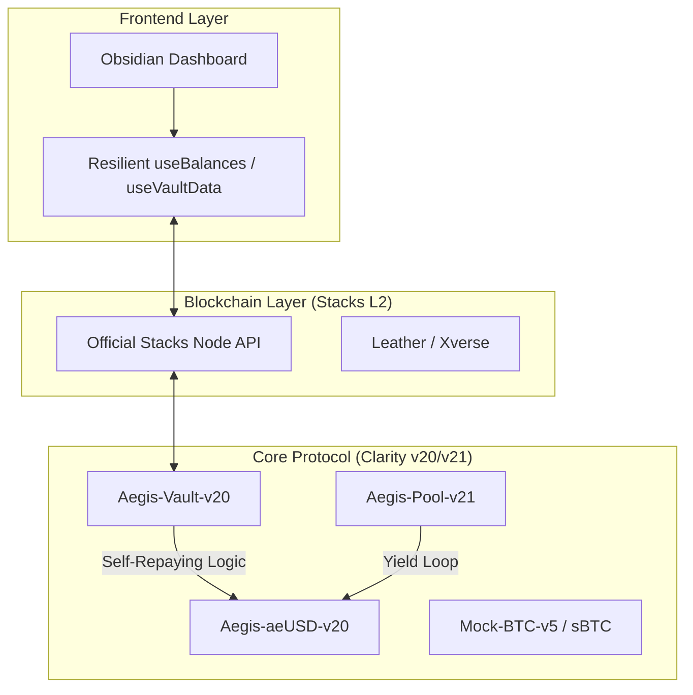

# 🛡️ Aegis Vault: The Bitcoin-Native Federal Reserve

[](https://nextjs.org/)
[](https://stacks.co/)
[](https://clarity-lang.org/)
[](LICENSE)

**Decentralized, non-custodial credit protocol on Stacks.**  
Mint institutional-grade stablecoins (**aeUSD**) against **sBTC** collateral, where the debt auto-repays itself using native Bitcoin yield.

---

## 📽️ Cinematic Pitch & Vision
> "Bitcoin has a $2 Trillion problem: it's lazy money. Aegis Vault makes Bitcoin work so you don't have to."

Aegis Vault turns Bitcoin into productive capital. By leveraging **sBTC** and Stacks' **Proof-of-Transfer (PoX)** rewards, we've built a protocol where loans aren't a burden—they are a self-sustaining asset.

---

## 🧩 The Architecture
Aegis Vault utilizes a multi-layered synchronization between the **Next.js Obsidian UI**, the **Stacks Blockchain**, and **Clarity Smart Contracts**.

### **System Workflow**


---

## 🚀 Key Features

*   **⚡ Instant Liquidity**: Peg-in BTC and mint aeUSD in one click with our account-abstracted UX.
*   **🔄 Self-Repaying Mechanics**: Protocol yield (PoX/LP rewards) is automatically directed to satisfy principal debt.
*   **💎 Obsidian Aesthetic**: A premium, high-stakes interface designed for the next generation of Bitcoin maximalists.
*   **🛡️ Mathematical Security**: Built with Clarity—a decidable, non-Turing complete language that is mathematically incapable of many common Solidity exploits.
*   **🌐 Resilient Fetching**: Native integration with the stable Stacks Node RPC for real-time balance tracking.

---

## 📜 Smart Contract Registry (Testnet)

| Contract | Version | Principal Address |
| :--- | :--- | :--- |
| **Aegis Vault** | `v20` | `ST2NJZE3SPW0GCPC0YE4V805HTSAGNQJF1HXT6PKY.aegis-vault-v20` |
| **aeUSD Stablecoin**| `v20` | `ST2NJZE3SPW0GCPC0YE4V805HTSAGNQJF1HXT6PKY.aegis-aeusd-v20` |
| **Liquidity Pool**  | `v21` | `ST2NJZE3SPW0GCPC0YE4V805HTSAGNQJF1HXT6PKY.aegis-pool-v21` |
| **LP Token**        | `v21` | `ST2NJZE3SPW0GCPC0YE4V805HTSAGNQJF1HXT6PKY.aegis-lp-token-v21` |
| **BTC Simulation**  | `v5`  | `ST2NJZE3SPW0GCPC0YE4V805HTSAGNQJF1HXT6PKY.mock-btc-v5` |

---

## 🛠️ Tech Stack

*   **Frontend**: Next.js 15, Tailwind CSS, Framer Motion, Lucide Icons.
*   **State**: Stacks.js (v7 Protocol Synthesis), Custom React Hooks for real-time network resilience.
*   **Smart Contracts**: Clarity (Stacks L2 Smart Contracts).
*   **Development**: Clarinet for localized testing and contract simulation.

---

## 🏃 Getting Started

### **1. Prerequisites**
*   [Leather Wallet](https://leather.io/) or [Xverse](https://www.xverse.app/) (Set to **Testnet**).
*   Node.js v18+.

### **2. Local Setup**
```bash
git clone https://github.com/Aaditya1273/Aegis-Vault.git
cd Aegis-Vault/frontend
npm install
npm run dev
```

### **3. Claim Testnet BTC**
Head to the **Deposit** page and use our **Institutional Bridge Simulation** button to claim mock BTC for hacking.

---

## 🏆 Buidl Battle Submission
Aegis Vault aligns perfectly with the **Bitcoin Builders Tournament** vision:
1.  **Innovation**: Pooled PoX yield for debt amortization.
2.  **sBTC Demand**: Creates a high-utility sink for pegged Bitcoin.
3.  **UI/UX Excellence**: Institutional-grade interface that rivals modern fintech.

---

## ⚖️ License
Distributed under the MIT License. See `LICENSE` for more information.

---

*Built with ❤️ for the Bitcoin Builders Community.*  
**[Pitch Video Script](./docs/cinematic_script.md)** | **[Technical Docs](./docs/idea.md)**
